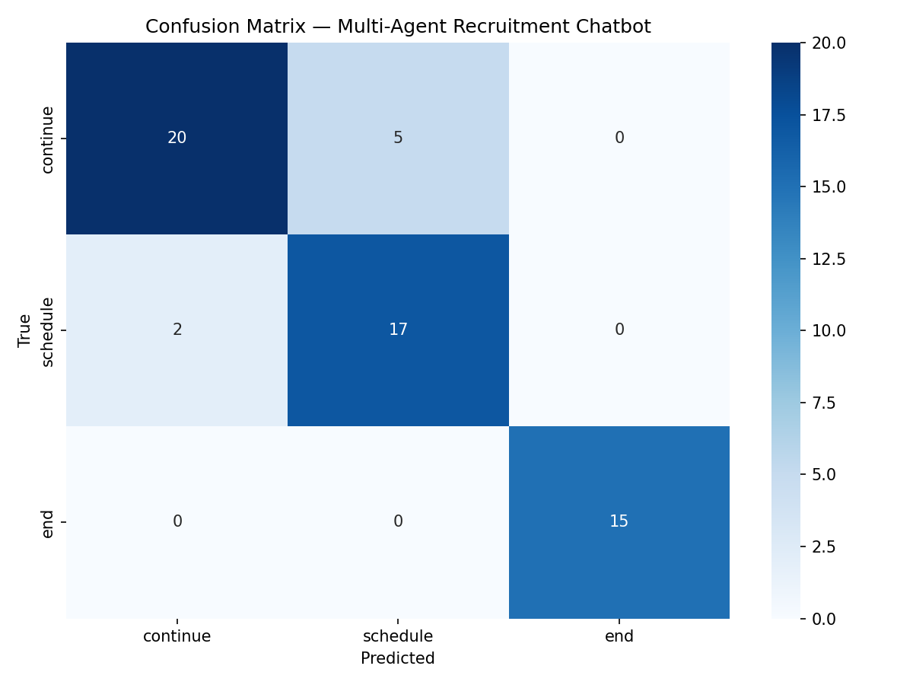

<!-- PROJECT LOGO -->
<p align="center">
  
</p>

<h1 align="center">🔥 Hell Corp — SMS Recruitment Chatbot</h1>

<p align="center">
  A multi-agent AI chatbot for automated candidate screening via SMS<br>
</p>

---
<br></br>

## Table of Contents

- [About The Project](#about-the-project)
- [Features](#features)
- [Getting Started](#getting-started)
- [Usage](#usage)
- [Screenshots](#screenshots)
- [Code Examples](#code-examples)
- [Evaluation Results](#evaluation-results)
- [Project Structure](#project-structure)
- [To-Do List](#to-do-list)
- [Contact](#contact)
- [Acknowledgments](#acknowledgments)

---
<br></br>

## About The Project

> This project automates the initial recruitment screening process for a **Python Developer** position at **Hell Corp's 7th Circle Branch**. A system of specialized AI agents conducts SMS conversations with job candidates — gathering information, answering questions, and scheduling interviews — all autonomously, with a devilish sense of humor. 😈<br>
>
> - When an interview is booked → **"Welcome to Hell 🔥"**
> - When the candidate is not interested → **"Maybe you'll have better luck in Paradise 😇"**

<div style="background: #272822; color: #f8f8f2; padding: 10px; border-radius: 8px;">
  <b> Technologies:</b> Python, OpenAI API (GPT-4o, Fine-tuning), ChromaDB, Streamlit, SQLite, LangChain
</div>

### Models Used

| Component | Model | Purpose |
|-----------|-------|---------|
| Main Agent | `gpt-4o` | Conversation orchestration, action classification |
| Info Advisor | `gpt-4o` | RAG-based Q&A about the job position |
| Scheduling Advisor | `gpt-4o` | Function calling for interview scheduling |
| Exit Advisor (base) | `gpt-4o` | Fallback conversation-end detection |
| Exit Advisor (fine-tuned) | `ft:gpt-4o-mini-2024-07-18:personal::DKjrJXBp` | Fine-tuned end/continue classifier |
| Embeddings | `text-embedding-3-small` | Document vectorization for ChromaDB |

---
<br></br>

## Features

- [x] Multi-agent orchestration (Main Agent, Info Advisor, Scheduling Advisor, Exit Advisor)
- [x] RAG-based Q&A using ChromaDB embeddings
- [x] Function calling for interview scheduling via SQL database
- [x] Fine-tuned model for conversation-end detection
- [x] Streamlit web UI for interactive chat
- [x] CLI mode for terminal-based conversations
- [x] Evaluation pipeline with accuracy metrics & confusion matrix
- [x] Labeled test dataset (15 conversations, 59 examples)

---
<br></br>

## Getting Started

### Prerequisites

- Python >= 3.11
- OpenAI API key

### Installation

```bash
# 1. Clone the repository
git clone https://github.com/stolena2010-blip/CHAT-BOT-PROJEXT.git
cd CHAT-BOT-PROJEXT

# 2. Create virtual environment
python -m venv .venv

# 3. Activate it
# Windows:
.venv\Scripts\activate
# macOS/Linux:
source .venv/bin/activate

# 4. Install dependencies
pip install -r requirements.txt

# 5. Configure environment variables
# Edit .env and set your OPENAI_API_KEY
```

### Build the Vector Store (one-time setup)

```bash
python -m app.modules.embedding.embedding
```

### Fine-Tune the Exit Advisor (optional)

```bash
# Prepare training data only:
python -m app.modules.fine_tuning.fine_tuning --prepare-only

# Full pipeline (prepare + upload + fine-tune):
python -m app.modules.fine_tuning.fine_tuning
# When done, add FINE_TUNED_EXIT_MODEL=ft:... to your .env
```

---
<br></br>

## Usage

### CLI Mode

```bash
python -m app.main
```

### Streamlit Web UI

```bash
streamlit run streamlit_app/streamlit_main.py
```

### Run Evaluation

```bash
python -m app.modules.evaluation.evaluation
```

Or open `tests/test_evals.ipynb` in Jupyter.

---
<br></br>

## Screenshots

<p float="left">
  
</p>

---
<br></br>

## Code Examples

```python
from app.modules.agents.main_agent import MainAgent

# Initialize the main agent
agent = MainAgent()

# Process a candidate message
response = agent.process_message("I have 5 years of Python experience with Django.")
print(response)
```

```
Recruiter: Hi, thanks for submitting your application...
Candidate: I have 5 years of Python experience with Django.
Recruiter: Great! Could we schedule an interview? We have slots on...
  [action: schedule]
```

---
<br></br>

## Evaluation Results

**Accuracy: 88.14%** with GPT-4o on 59 labeled examples (15 conversations).

| Class | Precision | Recall | F1-Score | Support |
|-------|-----------|--------|----------|--------|
| continue | 0.91 | 0.80 | 0.85 | 25 |
| schedule | 0.77 | 0.89 | 0.83 | 19 |
| end | 1.00 | 1.00 | 1.00 | 15 |

### Model Comparison Experiments

| Model | Type | Accuracy | Notes |
|-------|------|----------|-------|
| **GPT-4o** | General | **88.14%** | Best — fast, focused, accurate |
| o4-mini | Reasoning (small) | 71.19% | Over-reasons simple classifications |
| GPT-5.4 | General (new) | 62-68% | Not calibrated for existing prompts |

---
<br></br>

## Project Structure

```text
project/
├── app/                                    # Main application code
│   ├── __init__.py
│   ├── main.py                             # CLI entry point
│   └── modules/
│       ├── __init__.py
│       ├── agents/                         # AI Agents
│       │   ├── __init__.py
│       │   ├── main_agent.py               # Orchestrator (Main Agent)
│       │   ├── info_advisor.py             # RAG-based Q&A advisor
│       │   ├── scheduling_advisor.py       # Function-calling scheduler
│       │   └── exit_advisor.py             # End-of-conversation detector
│       ├── database/                       # SQL Database module
│       │   ├── __init__.py
│       │   └── database.py                 # Schedule queries
│       ├── embedding/                      # ChromaDB embedding module
│       │   ├── __init__.py
│       │   └── embedding.py                # PDF → vectors
│       ├── fine_tuning/                    # Fine-tuning module
│       │   ├── __init__.py
│       │   └── fine_tuning.py              # Training data prep + job launch
│       └── evaluation/                     # Evaluation module
│           ├── __init__.py
│           └── evaluation.py               # Accuracy + confusion matrix
├── streamlit_app/                          # Streamlit web UI
│   ├── __init__.py
│   ├── streamlit_main.py                   # Chat interface
│   └── utils.py                            # Helper functions
├── tests/                                  # Tests & evaluation
│   └── test_evals.ipynb                    # Jupyter notebook with metrics
├── chroma_db/                              # Vector store data
├── fine_tuning_data/                       # Fine-tuning training data
│   └── exit_advisor_training.jsonl
├── .env                                    # API keys (not in git)
├── .gitignore                              # Git ignore rules
├── db_Tech.sql                             # SQL schema for schedule table
├── README.md                               # This file
├── requirements.txt                        # Python dependencies
├── run.bat                                 # Windows run script
└── sms_conversations.json                  # Labeled test dataset (15 conversations)
```

---
<br></br>

## To-Do List

- [x] Multi-agent architecture
- [x] RAG with ChromaDB embeddings
- [x] Function calling for scheduling
- [x] Fine-tuned Exit Advisor
- [x] Streamlit web UI
- [x] Evaluation pipeline
- [x] Confusion matrix visualization

---
<br></br>

## Contact

| Name | ID |
|------|-----|
| סטוליארוב ילנה | 313830622 |
| עינה הרפול | 038191110 |
| איתי גלמן | 060600475 |

**Email:** sto_len1@yahoo.com

**Project Link:** [https://github.com/stolena2010-blip/CHAT-BOT-PROJEXT](https://github.com/stolena2010-blip/CHAT-BOT-PROJEXT)

---
<br></br>

## Acknowledgments

- [Python](https://www.python.org/)
- [OpenAI API](https://platform.openai.com/docs/overview)
- [ChromaDB](https://www.trychroma.com/)
- [Streamlit](https://streamlit.io/)
- [LangChain](https://www.langchain.com/)

---
